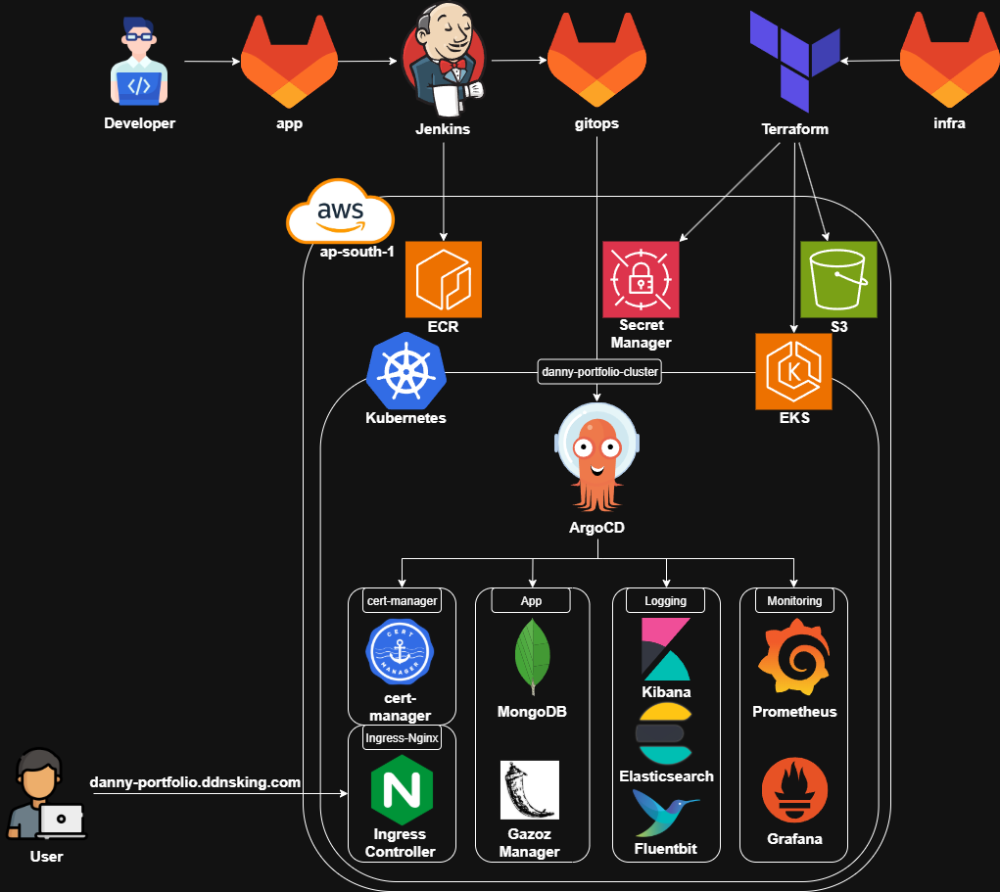

# DevOps Portfolio Project

## Overview

This portfolio showcases a comprehensive DevOps setup that covers application development, CI/CD automation, cloud infrastructure management, microservices, GitOps workflows, centralized logging, and system monitoring.

### Repositories

- **Application** (`app`): Python Flask application with a RESTful API connected to a MongoDB database.
- **GitOps Configuration** (`gitops`): GitOps configuration using Argo CD for automated deployments.
- **Infrastructure** (`infra`): Infrastructure as Code (IaC) setup using Terraform to provision AWS resources and Kubernetes clusters.

## Architecture

The project is based on a microservices architecture deployed on AWS using EKS for Kubernetes orchestration. Infrastructure is provisioned using Terraform for reproducibility and consistency. The application is containerized with Docker and deployed using GitOps principles via Argo CD.



## Technology Stack

- **Terraform:** Infrastructure provisioning and management
- **AWS:** Cloud provider (EKS, EC2, VPC, S3, ECR, IAM, Secrets Manager, etc.)
- **Kubernetes:** Container orchestration using AWS EKS
- **Helm:** Kubernetes package manager for application deployments
- **Argo CD:** GitOps tool for continuous delivery
- **GitLab:** Source control and CI/CD pipelines
- **Jenkins:** CI/CD automation
- **Docker:** Containerization of the application
- **Python: (Flask):** REST API development
- **MongoDB:** NoSQL database backend
- **Nginx Ingress Controller:** Routing external traffic to services in the cluster
- **EFK Stack:** Centralized logging
- **Prometheus & Grafana:** Monitoring and observability tools

## Documentation

Each repository includes its own `README.md` with detailed information on purpose, setup, and structure.

## Useful Commands

```
cd infra/        # Navigate into the Terraform infrastructure directory
terraform init   # Initialize Terraform, download providers, and prepare the environment
terraform plan   # Show a preview of infrastructure changes Terraform will make
terraform apply  # Apply the Terraform plan to create or update infrastructure on the cloud

aws eks --region ap-south-1 update-kubeconfig --name danny-portfolio-cluster  # Connect kubectl to the specified EKS cluster by updating kubeconfig
kubectl config get-context                                                    # Display all available Kubernetes contexts and the current one in use

kubectl port-forward svc/argocd-server -n argocd 8080:443                          # Expose the ArgoCD UI locally on port 8080
kubectl port-forward svc/kibana-kibana 8081:5601 -n logging                        # Expose the Kibana dashboard locally on port 8081
kubectl port-forward svc/kube-prometheus-stack-grafana -n monitoring 8082:80       # Expose the Grafana dashboard locally on port 8082
kubectl port-forward svc/kube-prometheus-stack-prometheus -n monitoring 8083:9090  # Expose the Prometheus web UI locally on port 8083
```

## Contact

Feel free to reach out with any questions, feedback, or suggestions.
