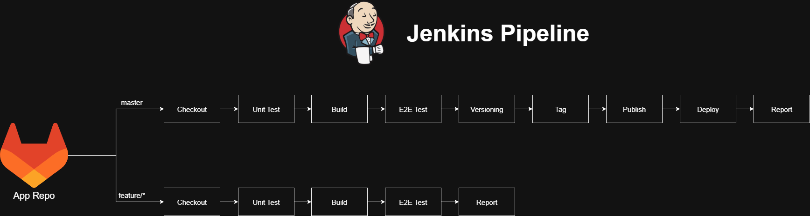
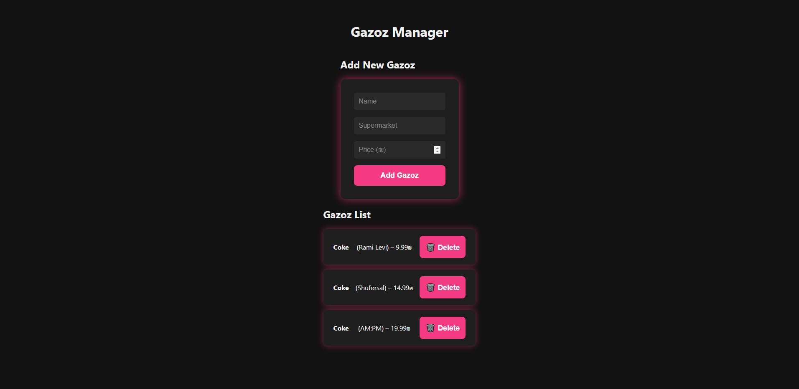

# Application repository

This repository contains the source code for the portfolio project's application. The application is built using Python and Flask, exposing a REST API and interacting with a MongoDB database.
The repository also includes a Jenkinsfile for automating the CI/CD pipeline.

# Jenkins Pipeline



# App Demo



## Structure

```text
├── src                        # Source code directory for the applcation
│   ├── backend                # Directory for the Flask-based backend logic and API routes
│   │   ├── database.py        # MongoDB connection and query logic
│   │   ├── models.py          # Data models/schema definitions
│   │   └── routes.py          # API route handlers
│   ├── frontend               # Directory for static frontend files
│   │   ├── app.js             # Frontend logic
│   │   ├── index.html         # Main HTML file for the web UI
│   │   └── styles.css         # CSS styling for the frontend
│   ├── app.py                 # Entry point for running the Flask app
│   ├── conftest.py            # Pytest configuration for testing
│   ├── unit_test.py           # Unit tests for backend components
│   ├── e2e_test.py            # End-to-end test script
├── docker-compose.yaml        # Docker Compose file for local multi-container setup
├── Dockerfile                 # Dockerfile for building the Flask application image
├── Dockerfile-mongodb         # Dockerfile for custom MongoDB container setup
├── Dockerfile-nginx           # Dockerfile for custom Nginx container setup
├── init-mongo.js              # MongoDB initialization script with sample data
├── Jenkinsfile                # Jenkins pipeline definition for CI/CD
├── nginx.conf                 # Nginx configuration for reverse proxy and routing
└── requirements.txt           # Python dependencies for the Flask application
```
