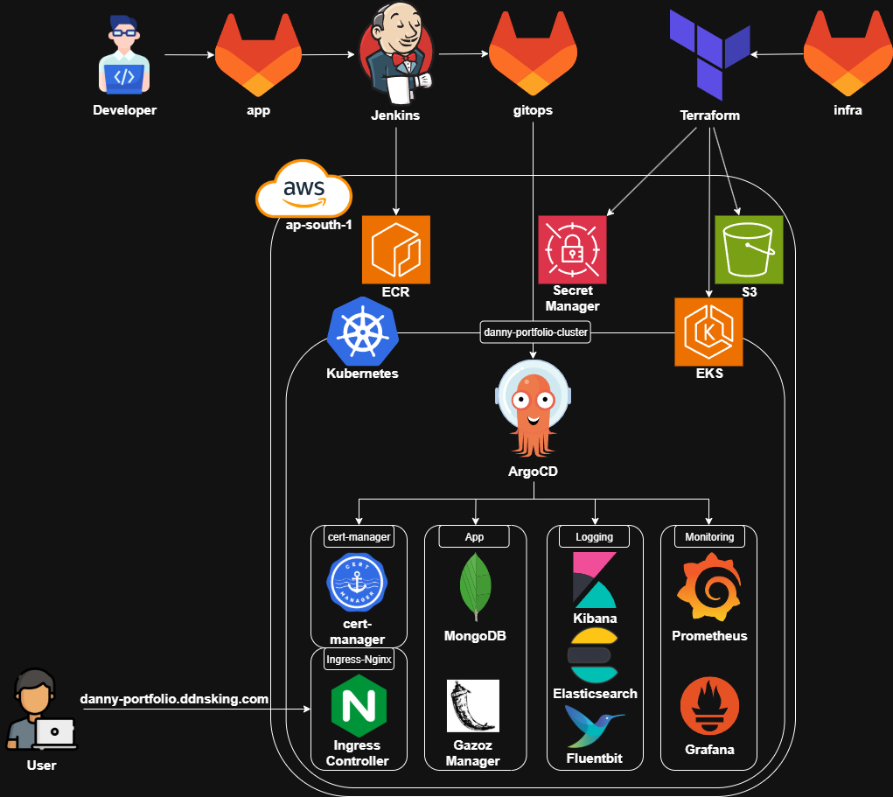
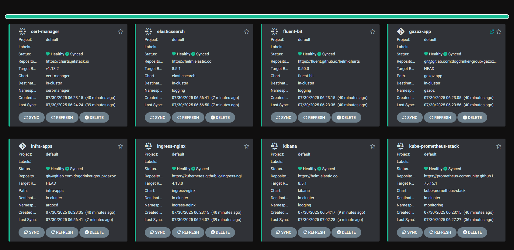
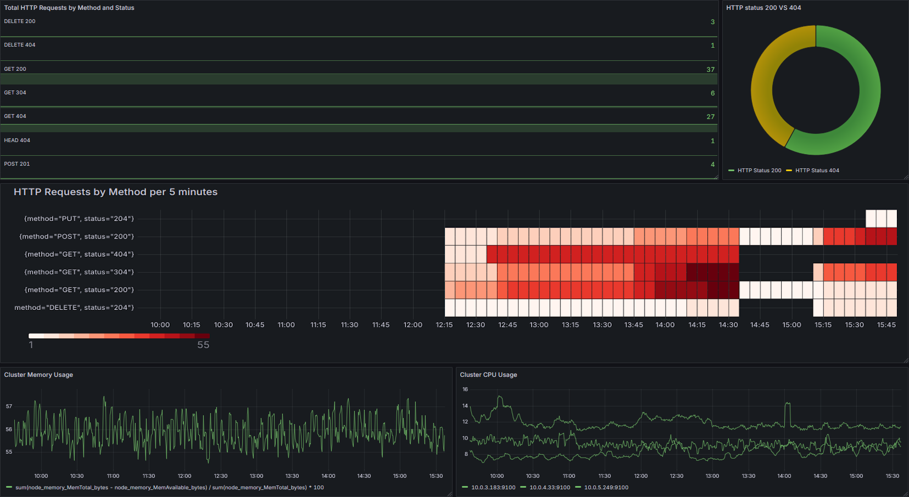
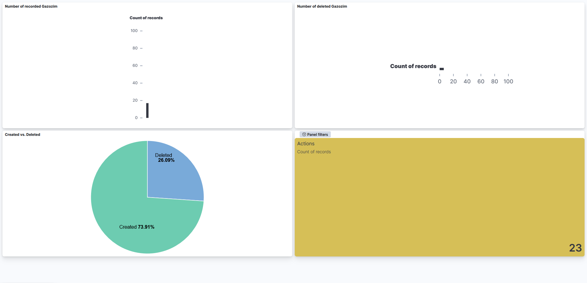

# GitOps Repository

This repository contains the GitOps configuration for deploying and managing both the application and supporting infrastructure services on a Kubernetes cluster using Argo CD. It follows a declarative approach, enabling automated, version-controlled deployments.

# Full Architecture



# ArgoCD View



# Grafana Dashboard



# Kibana Dashboard



## Structure

```text
├── gazoz-app                              # Directory for the Gazoz application + MongoDB Helm charts
│   ├── charts                             # Directory for the pre-packaged dependency charts
│   │   └── mongodb-16.5.30.tgz            # MongoDB Helm chart (packaged)
│   ├── templates                          # Directory for the Kubernetes manifest templates
│   │   ├── cluster-issuer.yaml            # Cert-manager configuration for TLS certificates
│   │   ├── configmap.yaml                 # App-specific configuration as ConfigMap
│   │   ├── deployment.yaml                # Deployment manifest for the application
│   │   ├── ingress.yaml                   # Ingress resource for external access
│   │   └── service.yaml                   # Service definition to expose the app internally
│   ├── Chart.yaml                         # Helm chart metadata file
│   └── values.yaml                        # Default configuration values for Helm templates
├── infra-apps                             # Directory for the infrastructure applications
│   ├── values                             # Directory for the custom Helm charts value files
│   │   ├── elastic-values.yaml            # Configuration overrides for Elasticsearch
│   │   ├── fluent-values.yaml             # Configuration overrides for Fluentbit
│   │   ├── kibana-values.yaml             # Configuration overrides for Kibana
│   │   ├── prometheus-values.yaml         # Configuration overrides for Prometheus and Grafana
│   ├── cert-manager.yaml                  # Argo CD app definition for Cert-Manager
│   ├── elasticsearch.yaml                 # Argo CD app definition for Elasticsearch
│   ├── fluentbit.yaml                     # Argo CD app definition for Fluentbit
│   ├── ingress-controller.yaml            # Argo CD app definition for Nginx Ingress Controller
│   ├── kibana.yaml                        # Argo CD app definition for Kibana
│   ├── prometheus-stack.yaml              # Argo CD app definition for Prometheus and Grafana
├── gazoz-app.yaml                         # Argo CD application resource for the Gazoz app
├── infra-apps.yaml                        # Argo CD application resource grouping all infrastructure applications
```
