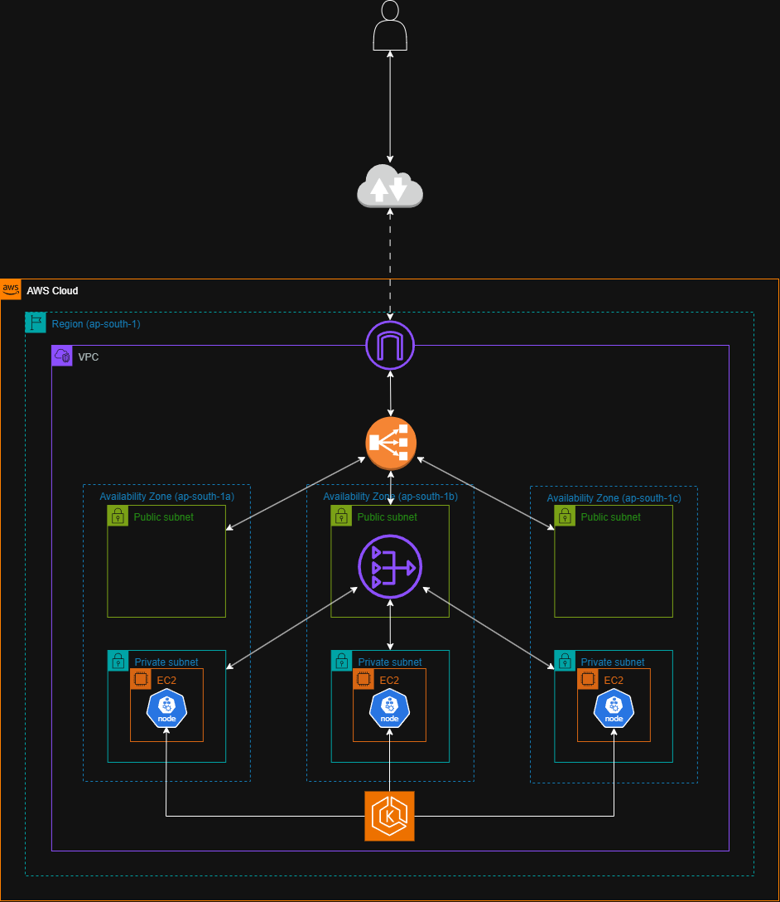

# Infrastructure Repository

This repository contains the infrastructure as code (IaC) configuration for deploying and managing the cloud-based infrastructure required for the portfolio project. The infrastructure setup is based on AWS, using Terraform to provision and manage resources.

# Infrastracture Overview



## Repository Structure

```text
├── modules                           # Directory for reusable Terraform modules organized by functionality
│   ├── argocd                        # Directory for Argo CD module for deployment and configuration
│   │   └── templates                 # Directory for templated YAML files rendered by Terraform
│   │       ├── app.yaml.tpl          # Template for Argo CD application config (Gazoz app)
│   │       └── infra_app.yaml.tpl    # Template for Argo CD application config (infra apps)
│   │   ├── argocd.tf                 # Argo CD setup (e.g., deployments, RBAC)
│   │   ├── iam.tf                    # IAM roles/policies required by Argo CD
│   │   ├── providers.tf              # Provider configuration for the Argo CD module
│   │   ├── variables.tf              # Input variables for customizing Argo CD deployment
│   ├── compute                       # Directory for compute module for provisioning compute infrastructure (e.g., EKS, node groups)
│   │   ├── compute.tf                # Defines EKS cluster, node groups, etc.
│   │   ├── iam.tf                    # IAM roles/policies for compute resources
│   │   ├── output.tf                 # Outputs such as EKS cluster endpoint or node role ARNs
│   │   ├── providers.tf              # AWS provider configuration specific to compute module
│   │   ├── sg.tf                     # Security group definitions for compute resources
│   │   └── variables.tf              # Input variables for compute resources
│   └── network                       # Directory for network module for provisioning network infrastructure (e.g., VPC, subnets, NAT Gateway, Internet Gateway)
│       ├── network.tf                # Defines VPC, public/private subnets, NAT/internet gateways
│       ├── output.tf                 # Outputs such as VPC ID, subnet IDs
│       ├── providers.tf              # AWS provider for networking resources
│       ├── variables.tf              # Input variables for the networ resources
├── backend.tf                        # Remote backend configuration for storing Terraform state
├── fix-pv.sh                         # Bash script to patch EC2 instances for EBS volume provisioning
├── main.tf                           # Root module tying together all other modules
├── namespaces.tf                     # Creates Kubernetes namespaces for workloads and services
├── providers.tf                      # Global provider configuration (e.g., AWS, Kubernetes, Helm)
├── secrets.tf                        # Manages secrets stored in AWS Secrets Manager
├── terraform.tfvars                  # Input variable values used by Terraform during execution
└── variables.tf                      # Variable definitions for the root module
```
